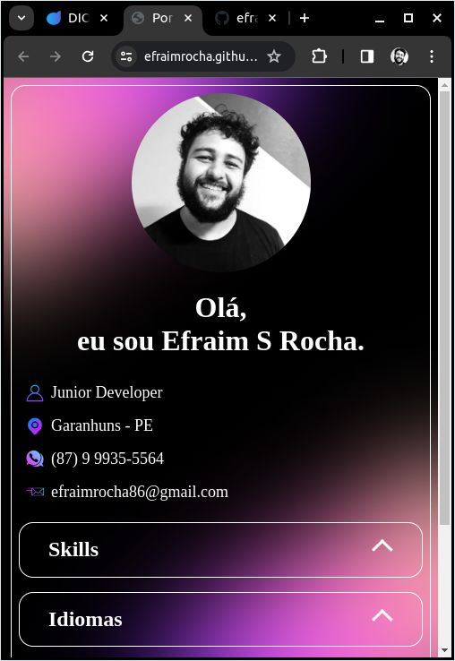
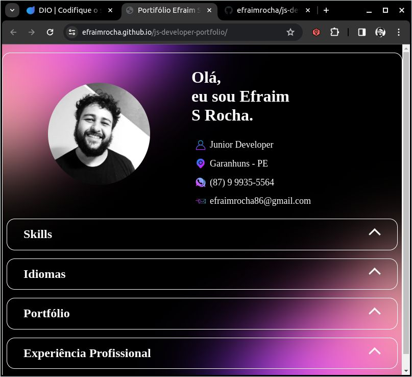
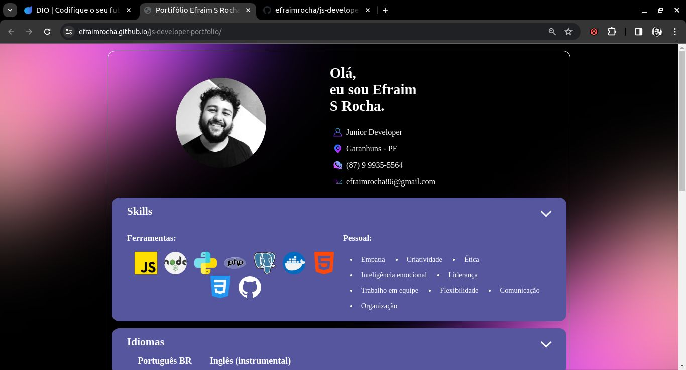

# Efraim Rocha - Portfolio Responsivo de Desenvolvelsvido em JavaScript.

Bem-vindo ao meu repositório de portfólio responsivo desenvolvido durante o curso "Desenvolvimento de Software com JavaScript" na Digital Innovation One (DIO). Este projeto é a materialização do aprendizado adquirido, destacando minhas habilidades como desenvolvedor JavaScript.

## Características Principais

- **Responsividade:** O portfólio é totalmente responsivo, proporcionando uma experiência de usuário consistente em dispositivos de diferentes tamanhos, desde smartphones até desktops.
  
- **Consumo de Dados Dinâmico:** Utilizei um arquivo JSON para gerenciar dados que alimentam o portfólio. Isso permite uma fácil manutenção e atualização das informações sem a necessidade de alterações no código-fonte.

- **Montagem Dinâmica:** As seções do portfólio são montadas dinamicamente a partir dos dados do arquivo JSON. Isso proporciona flexibilidade e facilidade na expansão do conteúdo sem a necessidade de modificações extensivas no código.

## Como Utilizar

1. Clone este repositório: `git clone https://github.com/efraimrocha/js-developer-portfolio.git`
2. Abra o arquivo `index.html` no seu navegador ou faça o deploy online [aqui](https://efraimrocha.github.io/js-developer-portfolio/).

## Screenshots

## Estrutura do Repositório

- **`data/profile.json`:** Contém os dados do portfólio, como projetos, habilidades e informações pessoais.

- **`data/imgs/`:** Contém imagens das hardskills.
  
- **`img/`:** Pasta contendo todas as imagens utilizadas no portfólio.

## Agradecimentos

Gostaria de expressar minha gratidão à Digital Innovation One por oferecer um curso tão abrangente e prático em JavaScript. Agradeço também a todos que me apoiaram ao longo desta jornada, fornecendo incentivo e feedback valioso.

Sinta-se à vontade para explorar o código-fonte e utilizar este projeto como inspiração para o seu próprio portfólio. Espero que este repositório seja útil para aprimorar suas habilidades de desenvolvimento!

**Repositório:** [GitHub](https://github.com/efraimrocha/js-developer-portfolio)  
**Deploy:** [Acesse aqui](https://efraimrocha.github.io/js-developer-portfolio/)
